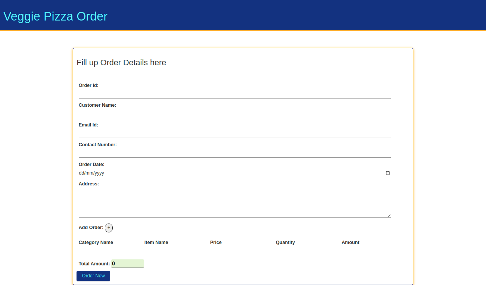
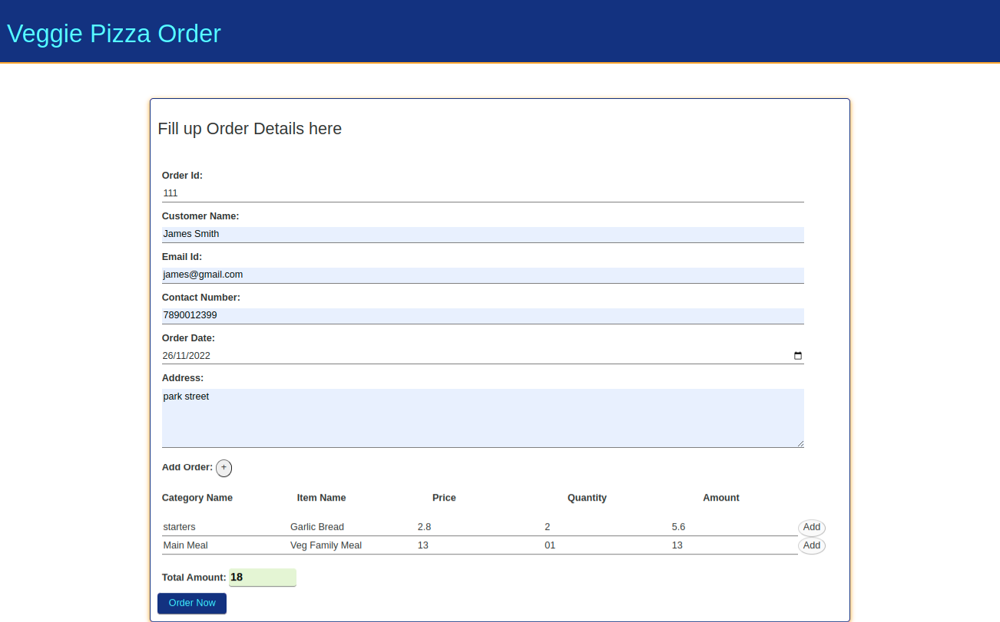
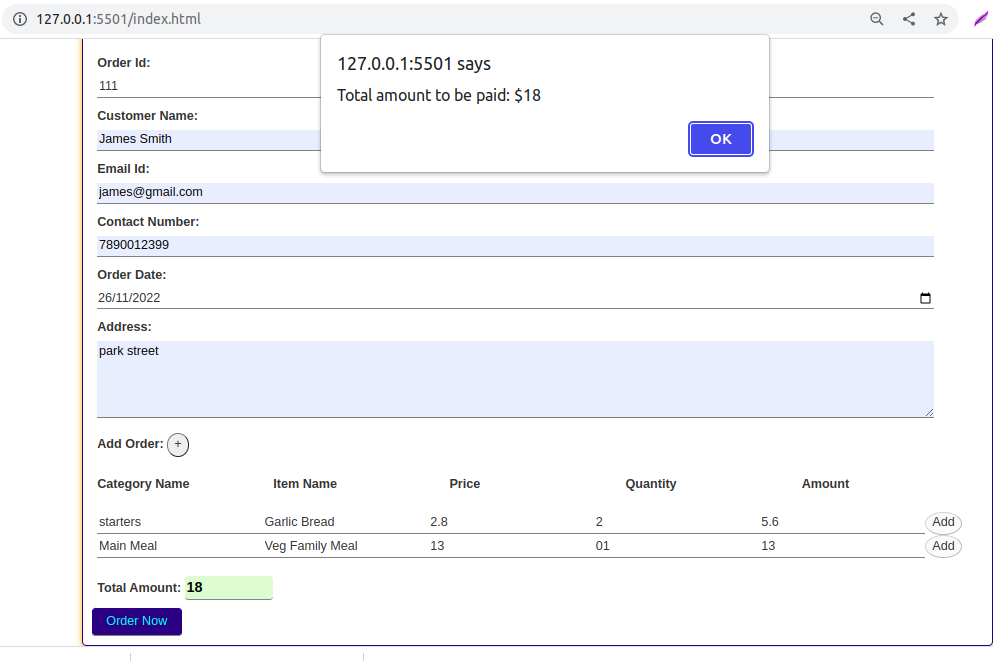

## Challenge - Create an order form and save the order details for the Veggie Pizza outlet

## Problem Statement

Veggie Pizza is a pizza delivery outlet that became popular for its custom-made vegetarian pizzas. A customer can order pizzas and other items by calling the outlet. The outlet delivers the order to the address specified by each customer.​
The outlet now have an app that allows the call operator to enter the order details and store them.​
Write a JS program to create an order form with validations, to add order items dynamically, to save the order details ​and calculate the total bill amount payable.​

### Tasks

The challenge can be performed by the following steps:​

#### Step 1 – Create Order Form With Validations​

- Open `index.html` file inside `solution` folder to create an HTML form.​
- An order form should be created with the fields and validations as listed in the table below.​
- Error messages should be displayed for the field inputs that do not fulfil the validation criteria. 
- Forms with invalid inputs should not get submitted.​

| Input Field​          | Validation​                                                      |
| --------------------- | ---------------------------------------------------------------- |
| Order Id​             | Should not be left blank​                                        |
| Order Date​           | Should be in correct date format​      |
| Customer Name​        | Should not be left blank                       |
|  Email Id      | Should not be left blank and should allow input of type email​   |
| Contact Number      | Should not be left blank  and  takes only 10 digitted number​​                                         |
| Customer Address​ | Should not be left blank and should have minimum 10 characters                                      |
| Order Amount​         | Should be non-editable and get updated as order items are added​ |

Dynamically Added Form Fields

| Input Field​          | Validation​                                                      |
| --------------------- | ---------------------------------------------------------------- |
| Category​  | Should not be left blank​                                                |
| Item Name​ | Should not be left blank​                                                |
| Price​     | Should not be left blank and should allow only numbers. Default value should be 0​  ​     |
| Quantity​  | Should not be left blank and should allow only numbers. Default value should be 0​                  |
|Total Amount​    | Should be non-editable and get updated as price or quantity are updated. Default value should be 0​​ |

#### Expected Output: For Reference

#### Step 2 – Add Order Items Dynamically

- Inside `index.html` file, add a button with the “+” icon in th order form.​
- Open the `script.js` file inside the `solution/js` folder to add JavaScript code.​
- Write a JS function such that when the user clicks the "+" button, input fields should get added dynamically, allowing the user to input order item details such as:

   * Category – could be an input field that allows the user to input category.​

  * Item name –  could be an input field that allows the user to input menu item.​

  * Price – could be an input field that allows only numbers to be inputted.

  * Quantity – could be a input field that allows only numbers to be inputted.​

  * Amount – could be a read-only field that displays the total amount whenever the price or quantity is updated.​

  * Add button  – Associate with click event listener programmatically to handle the click event.​

#### Expected Output: For Reference

#### Step 3 – Calculate Total Bill Amount​

- As the user enters order items and click the "add" button,​
    - The text field for “Total Bill Amount” should get updated with the sum of the amount of all order items.​
    - Save the ordered items in an array​
    - Make all fields read-only​
    - Disable the active state of the "add" button

**Note: The field should not be editable and should display the value as "0" initially.**

#### Step 4 – Save Order With a Successful Message

- Create a JavaScript function to save the order details.​
- Upon clicking the “Save Order” button, capture the order details and store it in an array.​
- Confirm the successful completion of the transaction by returning the following message :

    `Total amount to be paid: <totalAmount>`

#### Expected Output: For Reference

### General Instructions 

- Write the code in `script.js` under `solution/js` folder.
- Write the style in `style.css` under `solution/css` folder to provide custom styles for the form.
- Open the `index.html` file using Live Server and test the output.​​
​

